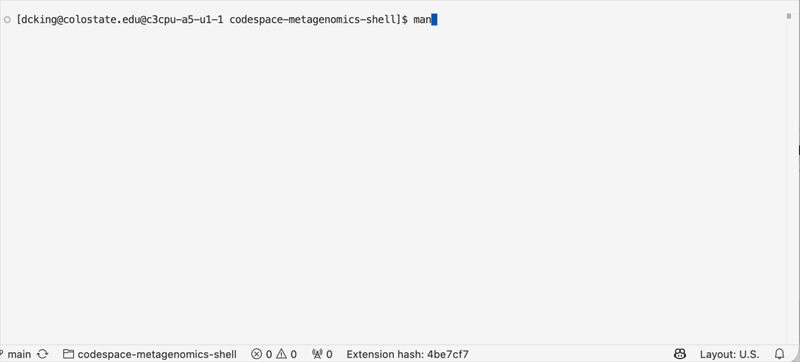

<!-- If you are in VS-Code, click in this window and do Shift-Ctrl/Command-V to view      -->
<!-- rendered text and links. This will open an editor tab labeled "Preview [this file]"  -->

## Example use of "less"

The command line tool `less` is invoked when looking at a man-page, such as `man ls`.

### Keyboard shortcuts for `less`

Note: Keystrokes are displayed on screen in the video. Refer to the table below.

| Key                               | symbol  | function      |
|-----------------------------------|---------|---------------|
| <kbd>q</kbd>                      | q       | quit          |
| <kbd>space</kbd>                  | ␣       | page forward  |
| <kbd>CTRL</kbd>-<kbd>F</kbd>      | ^F      | page forward  |
| <kbd>b</kbd>                      | b       | page backward |
| <kbd>g</kbd>                      | g       | goto top      |
| <kbd>Shift</kbd> <kbd>G</kbd>     | &uarr;G | goto bottom   |
| *Searching*                                                 |
| <kbd>/</kbd>                      | /       | search        |
| <kbd>n</kbd>                      | n       | next match    |
| <kbd>N</kbd>                      | N       | prev match    |
| *Other key symbols in video*                                |
| <kbd>return</kbd>                 | ↵       | return/enter  |
| <kbd>⇡</kbd>                      | ⇡       | up arrow  |